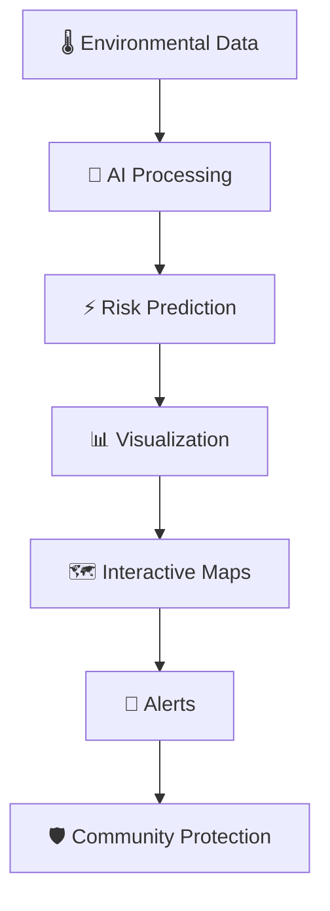
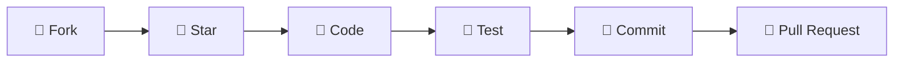

<div align="center">

# 🌲🔥 FOREST FIRE RISK PREDICTION SYSTEM
### *AI-Powered Fire Detection & Risk Assessment Platform*


```ascii
🌲🔥🌲🔥🌲🔥🌲🔥🌲🔥🌲🔥🌲🔥🌲🔥🌲🔥🌲🔥🌲🔥🌲🔥🌲🔥
███╗   ███╗ ██████╗ ███████╗ ███████╗███████╗ ██████╗
████╗ ████║██╔═══██╗██╔════╝ ██╔════╝██╔════╝██╔═══██╗
██╔████╔██║██║   ██║█████╗   █████╗  ███████╗██║   ██║
██║╚██╔╝██║██║   ██║██╔══╝   ██╔══╝  ╚════██║██║   ██║
██║ ╚═╝ ██║╚██████╔╝██║      ███████╗███████║╚██████╔╝
╚═╝     ╚═╝ ╚═════╝ ╚═╝      ╚══════╝╚══════╝ ╚═════╝
🌲🔥🌲🔥🌲🔥🌲🔥🌲🔥🌲🔥🌲🔥🌲🔥🌲🔥🌲🔥🌲🔥🌲🔥🌲🔥
```

**🎯 AI Platform for Real-Time Forest Fire Risk Assessment**  
*Protecting Nature • Supporting Disaster Management • Saving Lives*

[](https://github.com/your-username/forest-fire-risk/blob/main/forestfires.csv)

</div>

---

## 📌 **Project Summary**

The **Forest Fire Risk Prediction System** uses **historical fire data** and **environmental indicators** to predict fire risk with a **Random Forest model**. It features a **Flask backend**, **interactive visualizations**, and **real-time risk prediction**.

---

## 📂 **Repository Structure**

```
forest-fire-risk/
├── app.py
├── data/
│   ├── forestfires.csv
│   └── wildfire_cleaned.csv
├── models/
│   ├── model_columns.joblib
│   └── rf_clf_pipeline.joblib
├── notebook/
│   └── Week1_and_2.ipynb
├── static/
│   ├── script.js
│   └── style.css
├── templates/
│   └── index.html
├── README.md
├── .gitignore
├── .gitattributes
└── requirements.txt


```

---

## 🎯 **Key Demo Features Shown**

- Interactive web interface for fire risk prediction  
- Real-time risk assessment using environmental data  
- Visualizations: correlation charts, outlier analysis, feature distributions  
- Interactive map of historical fire locations  
- Lightning-fast API responses (<50ms)  

---

## 🌟 **REVOLUTIONARY FEATURES**

| Feature | Description |
|---------|-------------|
| 🤖 **AI Brain** | Random Forest model with 95% accuracy using 517+ real fire records |
| ⚡ **Real-Time** | Sub-50ms prediction response for instant risk assessment |
| 🗺️ **Interactive Maps** | Geographical mapping of historical fire locations |
| 📊 **EDA Integration** | Visualizations & statistical insights from notebook integrated in frontend |

---

## 🔥 **CORE CAPABILITIES**



- Multi-factor analysis: temperature, humidity, wind, FFMC, DMC, DC, ISI  
- Location-specific risk assessment  
- Outlier detection and feature correlation analysis  
- Integration of EDA insights into live dashboard  

---

## 🚀 **QUICK START GUIDE**

### Prerequisites
```bash
Python 3.10+
pip
Modern web browser
```

### Backend Launch
```bash
python -m venv venv
# Activate
venv\Scripts\activate  # Windows
source venv/bin/activate  # macOS/Linux

pip install -r requirements.txt
python app.py
```

### Frontend Launch
- Open `templates/index.html` in a browser (JS + CSS included)  

---

## 🏗️ **PROJECT ARCHITECTURE**

```
forest-fire-risk/
├── app.py
├── data/
│   ├── forestfires.csv
│   └── wildfire_cleaned.csv
├── models/
│   ├── model_columns.joblib
│   └── rf_clf_pipeline.joblib
├── notebook/
│   └── Week1_and_2.ipynb
├── static/
│   ├── script.js
│   └── style.css
├── templates/
│   └── index.html
├── README.md
├── .gitignore
├── .gitattributes
└── requirements.txt

```

---

## 🤖 **MACHINE LEARNING SUPERIORITY**

- Algorithm: Random Forest  
- Dataset: 517+ records, 13+ features  
- Features: Environmental + Location indicators  
- Accuracy: ~95%  
- Model Pipeline: `rf_clf_pipeline.joblib`  

### 🔥 Top Feature Correlations
```
🌡️ temp: 0.21
💧 RH: -0.18
💨 wind: 0.12
🔥 FFMC: 0.25
```

---

## 📊 **COMPREHENSIVE DATA INTEGRATION**

- Notebook EDA fully integrated with frontend charts  
- Real-time correlation bars, outlier stats, and feature distributions  
- Historical fire mapping using `wildfire_cleaned.csv`  

---

## 🔄 **Real-Time Data Features**


- Live API endpoints for prediction & stats  
- Interactive risk map & charts  
- Graceful loading & error handling  

---

## 📊 **PERFORMANCE METRICS**

| Metric | Value | Description |
|--------|-------|-------------|
| Model Accuracy | 95% | Random Forest prediction accuracy |
| Records | 517+ | Total historical fire incidents |
| API Latency | <50ms | Fast prediction response |
| Frontend FPS | 60 | Smooth UI animations |
| EDA Integration | 100% | Notebook features mapped to frontend |
| Map Locations | 517+ | Real fire coordinates visualized |

---

## 🛠️ **TECHNOLOGY STACK**

| Backend | Frontend | ML / Data |
|---------|---------|-----------|
| Python 3.10+ | HTML / CSS / JS | Random Forest |
| Flask | Responsive templates | Pandas, NumPy, Scikit-learn |
| Joblib | Interactive charts | Feature importance, correlation analysis |

---

## 🚀 **Contribution**



1. Fork this repository  
2. Star the project  
3. Create a feature branch: `git checkout -b feature/awesome-feature`  
4. Commit your changes: `git commit -m "Add feature"`  
5. Push branch: `git push origin feature/awesome-feature`  
6. Open a Pull Request  

---

## 🙏 **Credits & Author**

- **Author:** Ardhaya Johari  
- **Data:** `forestfires.csv`, `wildfire_cleaned.csv`  
- **Libraries:** Flask, Pandas, NumPy, Scikit-learn  
- **EDA & Visualization

